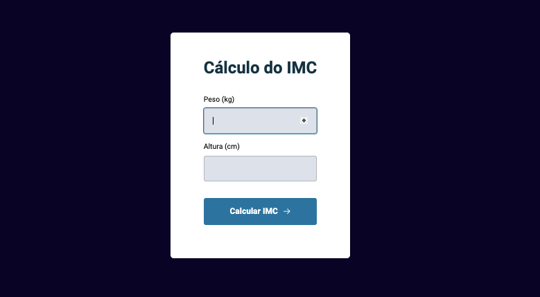

# Calculadora de IMC

RESMO: O índice de massa corporal é o cáculo do peso divido pela altura ao quadrado: Peso / (Altura)²

HTML

- Estruturas semânticas
- Formulário

CSS

- Estilização
- Transições
- Modal
- Organização de elementos na página
- Grid e Flex

JAVASCRIPT

- Variáveis
- Funções
- Objetos
- ES6 import e export
- Modularizando o projeto
- Refatorando o código
- Arrow functions
